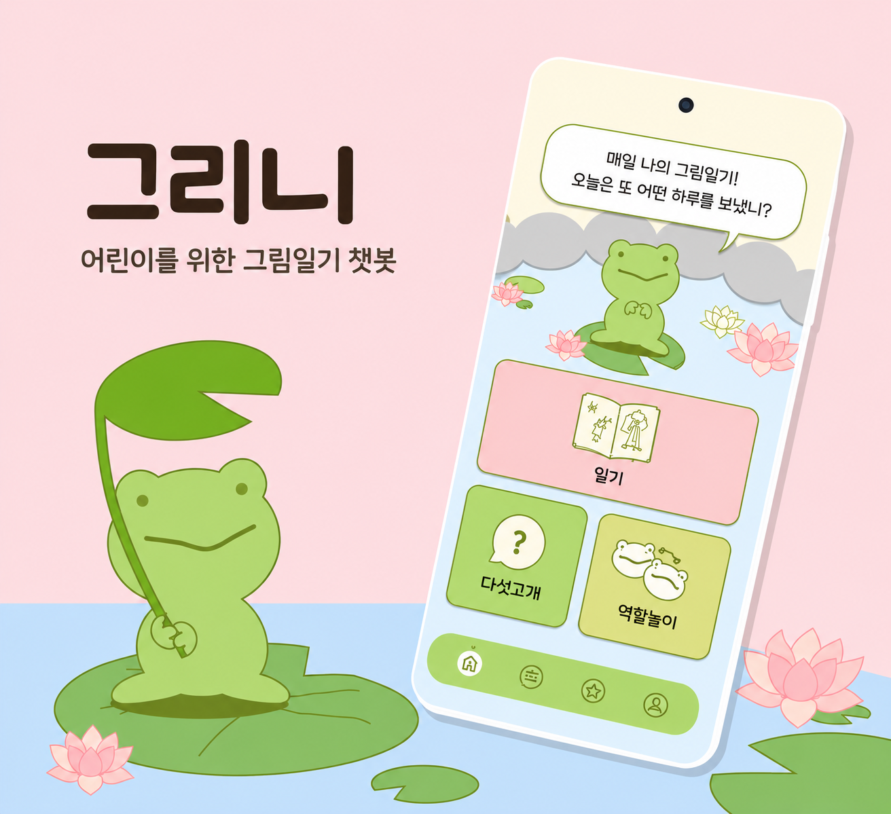
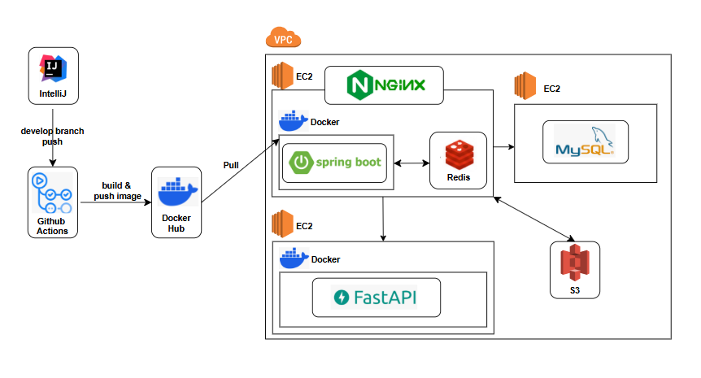

# 🐸 Greeni (그리니)

> **"아이의 목소리로 기록하고, AI가 마음을 읽어주는 디지털 놀이터"**
>
> AI 캐릭터와의 음성 대화를 통해 아이의 감정 표현과 언어 발달을 돕는 아동 대상 놀이형 대화 서비스 플랫폼입니다.

<div align="center">
  
</div>

## 1. 프로젝트 소개

그리니(Greeni)는 초등학교 저학년(만 7~11세) 아동이 친숙한 개구리 AI 캐릭터와 음성으로 실시간 상호작용하며 그림일기, 역할놀이, 다섯고개 등의 활동을 즐길 수 있는 AI 기반 아동 정서·놀이 서비스
플랫폼입니다.

단순한 단방향 학습 콘텐츠를 넘어, 음성 인식(STT)과 생성형 AI 기술을 활용하여 아이가 자신의 생각과 감정을 자연스럽게 표현할 수 있는 안전한 디지털 놀이 환경을 제공합니다. 보호자에게는 활동 기록과 LLM
기반의 감정 분석 통계를 제공하여, 자녀의 감정 변화와 관심사를 보다 쉽게 이해하고 소통할 수 있도록 지원합니다.

## 2. 프로젝트 배경 및 타겟

맞벌이 가정의 증가 등으로 부모와 자녀가 충분히 대화하는 시간이 줄어들고 있습니다. 아동기는 정서와 언어 능력이 빠르게 발달하는 중요한 시기임에도, 아이가 자신의 감정을 적절히 표현하거나 보호자가 이를 세심하게
파악하기는 쉽지 않습니다.

기존 아동 대상 디지털 기기 콘텐츠는 대부분 단순 영상 시청이나 일방향적인 주입식 학습에 치중되어 있어 아이의 정서 표현과 상호작용을 충분히 지원하지 못합니다. 또한 기존 서비스들은 초등학생 고학년 이상을 주요
대상으로 하는 경우가 많아, 저학년 아동의 발달 특성을 반영한 놀이 중심 대화 서비스는 상대적으로 부족한 실정입니다.

그리니는 이러한 문제의식에서 출발했습니다. 두 차례의 실제 아동 및 보호자 대상 유저 테스트를 거쳐 서비스의 주 타겟층을 최소한의 읽기 능력을 갖춘 초등학교 저학년(만 7~11세)으로 정교화하였습니다. 아이들이
강압적인 학습이 아닌 '놀이' 과정에서 자연스럽게 감정을 표현하고 언어적·사회적 능력을 향상시킬 수 있도록 돕고, 궁극적으로 AI 기술을 통해 아동과 보호자 간의 소통의 다리가 되는 것을 목표로 개발되었습니다.

## 3. 주요 기능 및 핵심 로직

* **AI 그림일기 (음성 대화 및 감정 추출)**
    * 아이가 AI와 음성(STT/TTS)으로 대화하며 하루의 경험을 정리하고 그림으로 일기를 남깁니다.
    * LLM이 대화 내용을 분석하여 **핵심 감정과 키워드를 자동으로 추출**하고, 텍스트 요약본을 함께 저장합니다.

* **다섯고개 (초성 기반 추리 놀이)**
    * AI가 특정 정답에 대해 최대 5개의 힌트를 순차적으로 제공하는 추리형 언어 놀이입니다.
    * 단순한 텍스트 힌트뿐만 아니라 **초성 힌트를 함께 제공**하여 저학년 아동의 눈높이에 맞게 난이도를 조절했습니다.

* **상황별 역할놀이 (안전한 상호작용 및 맥락 유지)**
    * 가게 주인, 선생님, 친구 등 다양한 상황을 설정하여 AI와 핑퐁 대화를 진행합니다.
    * LangChain의 메모리 기능을 활용해 **이전 대화의 맥락을 유지**하며, 폭력성이나 선정적인 주제로 빠지지 않도록 방어하는 **안전 필터링 프롬프트**가 적용되어 있습니다.

* **통계 및 활동 배지 (보호자 대시보드)**
    * 출석 일수와 일기 작성 횟수 등 활동 조건을 달성하면 **배지를 지급하는 시스템**을 구현하여 아이의 지속적인 참여를 유도합니다.
    * 보호자는 월별 감정 변화 그래프와 일별 활동 요약을 통해 아이의 정서 상태와 관심사를 직관적으로 확인할 수 있습니다.

## 4. UI 화면

## 5. 개발 기간 및 팀원 소개

**전체 개발 기간:** 2025.07 ~ 2026.06

* **25.07 ~ 25.08:** 프로젝트 기획 및 요구사항 정의
* **25.08:** UI/UX 설계
* **25.09 ~ 25.11:** 시스템 아키텍처 설계 및 백엔드/AI 서버 기초 개발
* **25.12 ~ 26.02:** 핵심 기능(그림일기, 놀이활동) API 구현 및 STT/TTS 연동
* **26.03 ~ 26.05:** 서버 안정화, 로직 개선 및 UI 연동
* **26.05:** 아동 및 보호자 대상 실제 사용자 테스트 진행
* **26.05 ~ 26.06:** HTTPS 적용, 앱 심사 대응 및 서비스 배포 마무리

<br>

|   이름    |   역할    | 담당 업무 (주요 기여)                                                                                                                                                                                                          |                     GitHub                     |
|:-------:|:-------:|:-----------------------------------------------------------------------------------------------------------------------------------------------------------------------------------------------------------------------|:----------------------------------------------:|
| **김은지** | Backend | • **ERD 및 API 아키텍처 설계**<br>• Spring Security와 JWT를 활용한 **로그인 및 보안 체계 구축**<br>• 대화 맥락 유지를 위한 **역할놀이 및 다섯고개 상태 관리 로직 구현**<br>• 활동 조건(출석, 횟수 등) 검증 기반 **배지 획득 알고리즘 구현**<br>• FastAPI **AI 서버와의 비동기 통신 파이프라인 및 데이터 규격 설계** |     [@hcg0127](https://github.com/hcg0127)     |
| **송민아** | Backend | • **ERD 및 API 아키텍처 설계**<br>• **회원가입 로직 구현**<br>• AWS S3 연동을 통한 **오디오/이미지 업로드 API 구축**<br>• AI 요약본 및 감정 데이터를 처리하는 **일기 로직 구현**<br>• GitHub Actions 기반 **CI/CD 파이프라인 및 AWS 자동 배포 구축**                                    |   [@ssongmina](https://github.com/ssongmina)   |
| **이시연** | Backend | • 다중 계정 처리를 위한 **프로필 관리 API 구현**<br>• 보호자용 대시보드를 위한 **월별 감정 추이 및 통계 데이터 집계 로직 구현**<br> • 사용자별 **획득 배지 목록 조회 API 구현**                                                                                                                                    | [@lee-si-yeon](https://github.com/lee-si-yeon) |

<br>

## 6. 기술 스택

| 구분                 | 기술                                                                            |
|--------------------|-------------------------------------------------------------------------------|
| **Language**       | Java 21                                                                       |
| **Framework**      | Spring Boot 3.5.6                                                             |
| **Database**       | MySQL (AWS RDS), Redis                                                        |
| **ORM**            | Spring Data JPA                                                               |
| **Infra & DevOps** | AWS (EC2, S3, RDS), Nginx, Docker, GitHub Actions                             |
| **AI Server 연동**   | FastAPI, OpenAI (GPT-4o, GPT-4o-mini, Transcribe), Naver CLOVA TTS, LangChain |

## 7. 시스템 아키텍처



그리니 서비스는 트래픽 부하를 분산하고 시스템의 확장성을 확보하기 위해 **비즈니스 로직 서버와 AI 서버를 물리적으로 분리**하였으며, Docker 기반의 자동화된 CI/CD 파이프라인을 구축했습니다.

* **CI/CD 파이프라인 (배포 자동화)**
    * `develop` 브랜치에 코드가 푸시되면 **GitHub Actions**가 이를 감지하여 애플리케이션을 빌드합니다.
    * 빌드된 이미지는 **Docker Hub**에 업로드(Push)되며, AWS EC2 운영 서버에서 최신 이미지를 내려받아(Pull) 자동으로 배포되도록 구성했습니다.

* **메인 비즈니스 서버 (Spring Boot)**
    * 클라이언트의 요청은 1차적으로 **Nginx**를 통해 안전하게 수신 및 라우팅됩니다.
    * **Spring Boot** 서버는 사용자 인증, 일기 및 놀이 기록 등 핵심 비즈니스 로직을 처리합니다.
    * 인증 토큰 및 임시 대화 상태 관리를 위해 인메모리 데이터 저장소인 **Redis**를 동일 인스턴스 내에 구성하여 응답 속도를 높였습니다.

* **AI 마이크로서비스 (FastAPI)**
    * STT, TTS, 생성형 AI(대화 및 감정 분석) 등 연산 리소스를 많이 소모하는 작업이 메인 서버에 병목을 일으키지 않도록 **독립된 EC2 인스턴스로 분리**하여 구축했습니다.

* **데이터베이스 및 스토리지**
    * **MySQL**: 사용자 정보, 프로필, 활동 기록, 감정 분석 결과 등 영구적인 데이터를 안전하게 관리하기 위해 별도의 DB 인스턴스를 구축했습니다.
    * **AWS S3**: 아동의 음성 녹음 파일 및 AI가 생성한 그림일기 이미지 등의 미디어 파일은 S3 객체 스토리지에 저장하여 서버의 스토리지 부하를 최소화했습니다.

## 8. 프로젝트 구조 및 설계 전략

그리니 백엔드 시스템은 유지보수성과 팀 협업 효율을 극대화하기 위해 다음과 같은 설계 전략을 바탕으로 구조화되었습니다.

### 핵심 설계 전략

1. **도메인 중심 패키지 구조 (Domain-Driven Package)**
    - 기존의 계층형(Layered) 구조에서 벗어나 `activities`, `diaries`, `members` 등 **도메인별로 패키지를 분리하여 리팩토링**했습니다.
    - 각 도메인 내부에 `controller`, `service`, `domain`, `dto` 등을 응집시켜, 새로운 기능이 추가되거나 오류가 발생했을 때 관련된 코드를 빠르게 파악하고 수정할 수 있도록
      유지보수성을 높였습니다.

2. **환경 프로필 분리 (Spring Boot Profile)**
    - 팀원 간의 로컬 DB 환경 충돌을 방지하고 CI/CD 배포 환경을 유연하게 관리하기 위해, `application.yml`과 `application-dev.yml`로 **스프링 부트 프로필을 명확히 분리
      **했습니다.
    - 이를 통해 각자의 로컬 환경을 독립적으로 관리하면서도, 운영 환경의 설정은 안전하게 보호할 수 있는 협업 환경을 구축했습니다.

<br>

<details>
<summary>📂 <b>전체 디렉토리 구조 보기 (클릭하여 펼치기)</b></summary>
<div markdown="1">

```text
src
├── main
│   ├── java
│   │   └── com
│   │       └── greeni
│   │           └── api
│   │               ├── ApiApplication.java
│   │               ├── activities
│   │               │   ├── controller
│   │               │   │   ├── ActivityController.java
│   │               │   │   └── docs
│   │               │   │       └── ActivityControllerDocs.java
│   │               │   ├── converter
│   │               │   │   └── ActivityConverter.java
│   │               │   ├── domain
│   │               │   │   ├── Activity.java
│   │               │   │   └── enums
│   │               │   │       ├── ActivityType.java
│   │               │   │       └── RoleName.java
│   │               │   ├── dto
│   │               │   │   ├── ActivityRequestDTO.java
│   │               │   │   └── ActivityResponseDTO.java
│   │               │   ├── repository
│   │               │   │   └── ActivityRepository.java
│   │               │   └── service
│   │               │       ├── ActivityService.java
│   │               │       └── ActivityServiceImpl.java
│   │               ├── ai
│   │               │   ├── controller
│   │               │   │   ├── AIController.java
│   │               │   │   └── docs
│   │               │   │       └── AIControllerDocs.java
│   │               │   ├── domain
│   │               │   │   ├── Purpose.java
│   │               │   │   └── RolePlayingType.java
│   │               │   ├── dto
│   │               │   │   ├── AIRequestDTO.java
│   │               │   │   └── AIResponseDTO.java
│   │               │   └── service
│   │               │       └── AIService.java
│   │               ├── apiPayload
│   │               │   ├── CommonResponse.java
│   │               │   ├── exception
│   │               │   │   └── ExceptionAdvice.java
│   │               │   ├── handler
│   │               │   │   └── GeneralException.java
│   │               │   └── status
│   │               │       ├── BadgeErrorStatus.java
│   │               │       ├── CommonErrorStatus.java
│   │               │       ├── DiaryErrorStatus.java
│   │               │       ├── ErrorReason.java
│   │               │       ├── JwtErrorStatus.java
│   │               │       ├── MemberErrorStatus.java
│   │               │       ├── ProfileErrorStatus.java
│   │               │       ├── S3ErrorStauts.java
│   │               │       ├── SuccessStatus.java
│   │               │       └── TermErrorStatus.java
│   │               ├── badges
│   │               │   ├── controller
│   │               │   │   ├── BadgeController.java
│   │               │   │   └── docs
│   │               │   │       └── BadgeControllerDocs.java
│   │               │   ├── converter
│   │               │   │   └── BadgeConverter.java
│   │               │   ├── domain
│   │               │   │   └── Badge.java
│   │               │   ├── dto
│   │               │   │   ├── BadgeRequestDTO.java
│   │               │   │   └── BadgeResponseDTO.java
│   │               │   ├── repository
│   │               │   │   └── BadgeRepository.java
│   │               │   └── service
│   │               │       ├── BadgeService.java
│   │               │       └── BadgeServiceImpl.java
│   │               ├── common
│   │               │   ├── base
│   │               │   │   └── BaseEntity.java
│   │               │   └── config
│   │               │       ├── EmailConfig.java
│   │               │       ├── RedisConfig.java
│   │               │       ├── S3Config.java
│   │               │       ├── SwaggerConfig.java
│   │               │       └── WebClientConfig.java
│   │               ├── diaries
│   │               │   ├── controller
│   │               │   │   ├── DiaryController.java
│   │               │   │   └── docs
│   │               │   │       └── DiaryControllerDocs.java
│   │               │   ├── converter
│   │               │   │   ├── DiaryConverter.java
│   │               │   │   └── VoiceConverter.java
│   │               │   ├── domain
│   │               │   │   ├── Diary.java
│   │               │   │   ├── Voice.java
│   │               │   │   └── enums
│   │               │   │       ├── Emotion.java
│   │               │   │       └── VoiceRole.java
│   │               │   ├── dto
│   │               │   │   ├── DiaryRequestDTO.java
│   │               │   │   └── DiaryResponseDTO.java
│   │               │   ├── repository
│   │               │   │   ├── DiaryRepository.java
│   │               │   │   └── VoiceRepository.java
│   │               │   └── service
│   │               │       ├── DiaryService.java
│   │               │       └── DiaryServiceImpl.java
│   │               ├── members
│   │               │   ├── controller
│   │               │   │   ├── MemberController.java
│   │               │   │   └── docs
│   │               │   │       └── MemberControllerDocs.java
│   │               │   ├── converter
│   │               │   │   ├── MemberConverter.java
│   │               │   │   └── MemberTermConverter.java
│   │               │   ├── domain
│   │               │   │   ├── Member.java
│   │               │   │   ├── Term.java
│   │               │   │   └── mapping
│   │               │   │       └── MemberTerm.java
│   │               │   ├── dto
│   │               │   │   ├── MemberRequestDTO.java
│   │               │   │   └── MemberResponseDTO.java
│   │               │   ├── repository
│   │               │   │   ├── MemberRepository.java
│   │               │   │   ├── MemberTermRepository.java
│   │               │   │   └── TermRepository.java
│   │               │   └── service
│   │               │       ├── MemberService.java
│   │               │       └── MemberServiceImpl.java
│   │               ├── profiles
│   │               │   ├── controller
│   │               │   │   ├── ProfileController.java
│   │               │   │   ├── ProfileStatisticsController.java
│   │               │   │   └── docs
│   │               │   │       ├── ProfileControllerDocs.java
│   │               │   │       └── ProfileStatisticsControllerDocs.java
│   │               │   ├── converter
│   │               │   │   └── ProfileConverter.java
│   │               │   ├── domain
│   │               │   │   ├── Profile.java
│   │               │   │   └── mapping
│   │               │   │       └── ProfileBadge.java
│   │               │   ├── dto
│   │               │   │   ├── ProfileRequestDTO.java
│   │               │   │   └── ProfileResponseDTO.java
│   │               │   ├── repository
│   │               │   │   ├── ProfileBadgeRepository.java
│   │               │   │   └── ProfileRepository.java
│   │               │   └── service
│   │               │       ├── ProfileQueryService.java
│   │               │       ├── ProfileService.java
│   │               │       └── ProfileServiceImpl.java
│   │               ├── s3
│   │               │   ├── controller
│   │               │   │   ├── S3Controller.java
│   │               │   │   └── docs
│   │               │   │       └── S3ControllerDocs.java
│   │               │   ├── converter
│   │               │   │   └── S3Converter.java
│   │               │   ├── dto
│   │               │   │   └── S3ResponseDTO.java
│   │               │   └── service
│   │               │       ├── S3Service.java
│   │               │       └── S3ServiceImpl.java
│   │               └── security
│   │                   ├── auth
│   │                   │   ├── controller
│   │                   │   │   ├── AuthController.java
│   │                   │   │   └── docs
│   │                   │   │       └── AuthControllerDocs.java
│   │                   │   ├── converter
│   │                   │   │   └── AuthConverter.java
│   │                   │   ├── dto
│   │                   │   │   ├── AuthRequestDTO.java
│   │                   │   │   └── AuthResponseDTO.java
│   │                   │   └── service
│   │                   │       ├── AuthResponseWriter.java
│   │                   │       ├── AuthService.java
│   │                   │       └── AuthServiceImpl.java
│   │                   ├── config
│   │                   │   ├── AuthenticationManagerConfig.java
│   │                   │   └── SecurityConfig.java
│   │                   └── jwt
│   │                       ├── dto
│   │                       │   └── JwtProperties.java
│   │                       ├── enums
│   │                       │   └── RedisTokenType.java
│   │                       ├── filter
│   │                       │   ├── JwtAuthenticationFilter.java
│   │                       │   └── JwtExceptionHandlerFilter.java
│   │                       ├── handler
│   │                       │   ├── JwtAccessDeniedHandler.java
│   │                       │   └── JwtAuthenticationEntryPoint.java
│   │                       ├── provider
│   │                       │   ├── CustomAuthenticationProvider.java
│   │                       │   └── JwtProvider.java
│   │                       ├── redis
│   │                       │   └── TokenManager.java
│   │                       ├── token
│   │                       │   └── CustomAuthenticationToken.java
│   │                       └── userDetails
│   │                           ├── CustomUserDetails.java
│   │                           └── CustomUserDetailsService.java
│   └── resources
│       ├── application-dev.yml
│       ├── application.yml
│       └── data.sql
└── test
    └── java
        └── com
            └── greeni
                └── api
                    └── ApiApplicationTests.java
```

</div>
</details>

## 9. 서비스 링크 (플레이 스토어 출시 완료)

현재 **그리니(Greeni)** 클라이언트 앱이 구글 플레이 스토어에 정식 출시되어 서비스 중입니다.
아래 배너를 클릭하시면 앱 다운로드 및 상세 페이지로 이동하여 실제 동작하는 서비스를 확인하실 수 있습니다.

<br>

<a href="https://play.google.com/store/apps/details?id=com.teamforest.greeni&pcampaignid=web_share" target="_blank">
  
</a>
